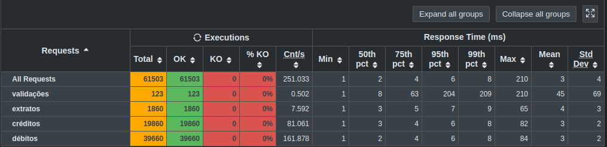

# Backend contest 2nd edition

This is an implementation for second edition of "rinha de backend" which is a backend contest 
originated in the brazilian dev community on Twitter.

This edition is focused on handling high concurrency while maintaining consistency.

The summarized proposed challenge is: simulate a minimal bank account 
that supports just saving transactions and getting statements.

For this, create an HTTP API with two endpoints, one for saving a transaction and one for getting the account statement
(last ten transactions only).

The solution must follow a required architecture: one load balancer using round-robin, two APIs instances
and a database (in memory dbs are not allowed).

And also a maximum resource usage of 1.5 CPU and 550MB of memory distributed across all components however you want.

Only five clients are registered on this bank, to focus on having high concurrency scenarios.

Then gatling is used to perform a stress test which ramps up to more than 300 active users.

You can find more details on the [original repo](https://github.com/zanfranceschi/rinha-de-backend-2024-q1) (in portuguese)

## My solution

I used java 21, spring boot (webflux + r2dbc), nginx and postgresql.

To handle concurrency I used postgresql advisory locks.

I also created a function on postgresql to insert transaction and update balance and another function to retrieve
the statement. Both functions returning JSON content.

This was not the best solution as I was delegating too much work to postgresql, which I had only one instance.

This is the results I got from the gatling stress test

